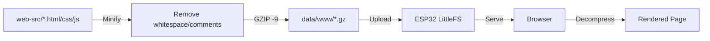

# 🐯 TigerTag Scale

> **Smart IoT scale with ESP32** — Real-time weight monitoring, RFID tracking, and cloud synchronization

[](https://www.espressif.com/en/products/socs/esp32)
[](https://www.arduino.cc/)
[](LICENSE)
[](https://github.com/yourusername/TigerTag-Scale)

## 📋 Table of Contents

- [Features](#-features)
- [Hardware](#-hardware)
- [Architecture](#-architecture)
- [Installation](#-installation)
- [Web Interface](#-web-interface)
- [API Documentation](#-api-documentation)
- [Performance](#-performance)
- [Development](#-development)
- [Troubleshooting](#-troubleshooting)
- [Changelog](#-changelog)
- [Contributing](#-contributing)
- [License](#-license)

---

## ✨ Features

### 🎯 Core Functionality
- **Real-time weight measurement** via HX711 load cell amplifier
- **RFID tag detection** (RC522 13.56MHz)
- **Live display** on OLED screen (SSD1306 128×64)
- **WebSocket streaming** for instant updates
- **Cloud synchronization** with TigerTag backend

### 🌐 Web Interface
- **Responsive design** — mobile & desktop optimized
- **GZIP compression** — 74.6% size reduction (11.4 KB → 2.9 KB)
- **Browser caching** — instant reload after first visit
- **Real-time updates** via WebSocket
- **Dark/Light mode** with localStorage persistence

### ⚙️ Advanced Features
- **Auto-calibration** with known weight
- **Tare function** for zero reset
- **WiFi Manager** — captive portal for easy setup
- **mDNS support** — access via `http://tigerscale.local`
- **OTA-ready** — separate firmware/data partitions
- **Auto-push to cloud** — stable weight detection algorithm
- **Non-blocking OLED UI** — removed transient `displayMessage()` + `delay()`; single state-driven renderer
- **Refined UX flow** — skips intermediate “Net ... / ✓ Synced!” screen and jumps directly to **IDLE with net weight** in large font

---

## 🛠️ Hardware

### Required Components

| Component | Model | Quantity | Link |
|-----------|-------|----------|------|
| **Microcontroller** | ESP32-WROOM-32 (CH340) | 1× | [Amazon](https://amzn.to/4hlnITL) |
| **Display** | OLED 0.96" 128×64 I2C (SSD1306) | 1× | [Amazon](https://amzn.to/47gIf7j) |
| **RFID Reader** | RC522 13.56MHz SPI | 1× | [Amazon](https://amzn.to/47mqpQt) |
| **Load Cell** | 5kg with HX711 amplifier | 1× | [Amazon](https://amzn.to/3KZIOLl) |
| **Wiring** | Dupont jumper wires (M-M, M-F, F-F) | 1 set | [Amazon](https://amzn.to/42QEdB9) |

### Wiring Diagram

```
ESP32 Pinout:
├─ OLED Display (I2C)
│  ├─ SDA → GPIO 21
│  ├─ SCL → GPIO 22
│  └─ VCC → 3.3V, GND → GND
│
├─ HX711 Load Cell
│  ├─ DOUT → GPIO 32
│  ├─ SCK  → GPIO 33
│  └─ VCC  → 3.3V, GND → GND
│
└─ RFID RC522 (SPI)
   ├─ SDA  → GPIO 5
   ├─ SCK  → GPIO 18
   ├─ MOSI → GPIO 23
   ├─ MISO → GPIO 19
   ├─ RST  → GPIO 27
   └─ VCC  → 3.3V, GND → GND
```

📄 **Full wiring guide:** [wiring-guide.html](wiring-guide.html)

⚠️ **Warning:** ESP32 GPIO pins are **NOT 5V tolerant**. Always use **3.3V** for all components.

---

## 🏗️ Architecture

### System Overview

```
┌─────────────────────────────────────────────────────┐
│                    ESP32 Device                     │
├─────────────────────────────────────────────────────┤
│  Hardware Layer                                     │
│  ├─ OLED (I2C)      : Real-time display           │
│  ├─ HX711 (Digital) : Weight sensor               │
│  └─ RC522 (SPI)     : RFID reader                 │
├─────────────────────────────────────────────────────┤
│  Firmware Layer (C++)                              │
│  ├─ WiFiManager     : Captive portal              │
│  ├─ ESPAsyncWebServer : HTTP/WebSocket server     │
│  ├─ LittleFS        : Compressed web files        │
│  └─ HTTPClient      : Cloud API calls             │
├─────────────────────────────────────────────────────┤
│  Web Interface Layer                               │
│  ├─ index.html.gz   : 863 bytes (67.7% compressed)│
│  ├─ style.css.gz    : 676 bytes (67.6% compressed)│
│  └─ app.js.gz       : 1428 bytes (79.4% compressed)│
└─────────────────────────────────────────────────────┘
              ↕ WebSocket (real-time)
              ↕ REST API (actions)
┌─────────────────────────────────────────────────────┐
│            Web Browser (Client)                     │
│  ├─ Real-time weight display                       │
│  ├─ RFID UID tracking                              │
│  ├─ Manual weight submission                       │
│  ├─ Calibration controls                           │
│  └─ WiFi/Config management                         │
└─────────────────────────────────────────────────────┘
              ↕ HTTPS API
┌─────────────────────────────────────────────────────┐
│         TigerTag Cloud (Backend)                    │
│  └─ Weight history storage                         │
└─────────────────────────────────────────────────────┘
```

### Flash Memory Layout (4 MB)

```
┌────────────────────┬──────────┬──────────────────────┐
│ Partition          │ Size     │ Purpose              │
├────────────────────┼──────────┼──────────────────────┤
│ nvs                │ 20 KB    │ WiFi credentials     │
│ otadata            │ 8 KB     │ OTA metadata         │
│ app0 (firmware)    │ 1.5 MB   │ Active firmware      │
│ app1 (OTA backup)  │ 1.5 MB   │ Update staging       │
│ spiffs (LittleFS)  │ 896 KB   │ Web interface files  │
└────────────────────┴──────────┴──────────────────────┘
Total: ~3.9 MB / 4 MB
```

---

## 🚀 Installation

### Prerequisites

- [PlatformIO](https://platformio.org/) (recommended) or Arduino IDE
- Python 3.7+ (for build automation)
- USB drivers: [CP210x](https://www.silabs.com/developers/usb-to-uart-bridge-vcp-drivers) or [CH340](https://www.wch-ic.com/downloads/CH341SER_ZIP.html)

### Quick Start

```bash
# 1. Clone repository
git clone https://github.com/yourusername/TigerTag-Scale.git
cd TigerTag-Scale

# 2. Install dependencies (automatic via PlatformIO)
pio pkg install

# 3. Build project (compresses web files automatically)
pio run

# 4. Upload filesystem (web interface)
pio run --target uploadfs

# 5. Upload firmware
pio run --target upload

# 6. Monitor serial output
pio device monitor
```

### First Boot Setup

1. **Power on** the ESP32
2. **Connect to WiFi** — captive portal appears as `TigerScale-Setup`
3. **Configure WiFi** credentials
4. **Optional:** Enter TigerTag API key for cloud sync
5. **Access interface** at `http://tigerscale.local` or IP shown on OLED

---

## 🌐 Web Interface

### Features

- **Real-time weight display** — updates every 500ms via WebSocket
- **RFID UID tracking** — shows decimal and hexadecimal values
- **Cloud status indicator** — green (OK) / red (DOWN)
- **Manual weight submission** — push specific values to cloud
- **Calibration tools:**
  - Tare (zero reset)
  - Manual factor adjustment
  - Auto-calculation from known weight
- **System management:**
  - WiFi reconfiguration
  - Factory reset
  - API key update
- **Sending screen** simplified — shows `Sending…` + short UID (no countdown) for cleaner transitions

### Performance Metrics

| Metric | Value |
|--------|-------|
| **Initial load time** | ~200-400ms (local WiFi) |
| **Total transfer size** | 2.9 KB (gzipped) |
| **WebSocket latency** | <20ms |
| **Cache hit (reload)** | <50ms |
| **Compression ratio** | 74.6% reduction |

---

## 📡 API Documentation

### REST Endpoints

#### `GET /api/status`
Returns current device status.

**Response:**
```json
{
  "weight": 1234,
  "uid": "123456789",
  "uid_hex": "075BCD15",
  "wifi": "MyNetwork",
  "ip": "192.168.1.100",
  "cloud": "ok",
  "apiKey": "your-api-key",
  "calibrationFactor": 406.0
}
```

#### `POST /api/config`
Update API key.

**Request:**
```json
{
  "apiKey": "new-api-key"
}
```

#### `POST /api/push-weight`
Send weight to TigerTag cloud.

**Request:**
```json
{
  "weight": 1234
}
```

**Response:**
```json
{
  "status": "ok"
}
```

**Device UX after success:** The scale immediately switches to **IDLE** and displays the **net spool weight** in large text (the intermediate “Net … / ✓ Synced!” screen is skipped).

#### `POST /api/tare`
Reset scale to zero.

**Response:**
```json
{
  "status": "ok"
}
```

#### `POST /api/calibration`
Update calibration factor.

**Request:**
```json
{
  "factor": 406.5
}
```

#### `POST /api/reset-wifi`
Restart into WiFi configuration mode.

#### `POST /api/factory-reset`
Erase all stored data and reboot.

### WebSocket

**Endpoint:** `ws://tigerscale.local/ws`

**Message format:**
```json
{
  "weight": 1234,
  "uid": "123456789"
}
```

---

## 📊 Performance

### Compilation Stats

```
RAM:   [==        ]  15.6% (51,236 / 327,680 bytes)
Flash: [========  ]  77.4% (1,218,153 / 1,572,864 bytes)
```

### Web Interface Compression

| File | Original | Minified | Gzipped | Reduction |
|------|----------|----------|---------|-----------|
| `index.html` | 2,668 B | 2,059 B | **863 B** | **-67.7%** |
| `style.css` | 2,085 B | 1,487 B | **676 B** | **-67.6%** |
| `app.js` | 6,927 B | 4,646 B | **1,428 B** | **-79.4%** |
| **Total** | **11,680 B** | **8,192 B** | **2,967 B** | **-74.6%** |

### Memory Optimizations

✅ **Zero RAM usage** for static files (served from Flash)  
✅ **Buffer streaming** — 512-byte chunks (no full file load)  
✅ **Browser caching** — 24-hour TTL reduces ESP32 load  
✅ **Async server** — non-blocking I/O prevents task stalls  

---

## 🛠️ Development

### Project Structure

```
TigerTag-Scale/
├── web-src/              # Web interface sources (editable)
│   ├── index.html
│   ├── style.css
│   └── app.js
├── data/
│   └── www/             # Generated gzipped files (auto)
├── scripts/
│   └── build_web.py     # Build automation script
├── src/
│   └── main.cpp         # Firmware source
├── include/
├── lib/
├── test/
├── platformio.ini       # PlatformIO configuration
├── partitions.csv       # ESP32 partition table
├── wiring-guide.html    # Hardware setup guide
├── index.html           # ESP32 web flasher page
├── manifest.json        # Firmware manifest
└── README.md
```

### Build Process



### Modify Web Interface

1. **Edit sources:** `web-src/index.html`, `style.css`, `app.js`
2. **Re-upload filesystem:**
   ```bash
   pio run --target uploadfs
   ```
3. **Refresh browser** (hard reload: Ctrl+Shift+R / Cmd+Shift+R)

### Modify Firmware

1. **Edit:** `src/main.cpp`
2. **Compile & upload:**
   ```bash
   pio run --target upload
   ```
3. **Monitor:**
   ```bash
   pio device monitor
   ```

### Useful Commands

```bash
# Full rebuild (filesystem + firmware)
pio run -t uploadfs -t upload

# Erase entire flash
pio run --target erase

# Verbose compilation (debug)
pio run -v

# Memory analysis
pio run --target size

# Update libraries
pio pkg update

# Full cycle (filesystem → firmware → monitor)
pio run -t uploadfs && pio run -t upload && pio device monitor
```

---

## 🐛 Troubleshooting

### Web Interface

| Issue | Solution |
|-------|----------|
| **404 Not Found** | Run `pio run --target uploadfs` |
| **Files not compressed** | Check `data/www/*.gz` exists |
| **No WebSocket connection** | Verify ESP32 IP, check firewall |
| **Stale cache** | Hard reload (Ctrl+Shift+R) |
| **Flicker to “Ready to weigh” between UID and Sending** | Fixed: state machine forces `SENDING` during countdown and prevents rollback |
---

## 🗓️ Changelog

### 2025-11-02
- OLED state machine cleaned up: removed blocking `delay()` calls and transient `displayMessage()` in critical flows
- Success path now skips the transient “Net … / ✓ Synced!” page and goes straight to **IDLE** with **net weight** (big)
- Idle screen with net weight now shows two helper lines: `remaining` and `Remove filament` (with improved vertical spacing)
- Prevented brief rollback to `Ready to weigh` before `Sending…` (forced `SENDING` state during countdown)
- `Sending…` screen simplified (removed `2s/1s` countdown), displays short UID only
- Minor layout polish on OLED (spacing and cursor positions)

### Hardware

| Issue | Solution |
|-------|----------|
| **OLED blank** | Check I2C address (0x3C), verify wiring |
| **RFID not reading** | Verify SPI connections, check RST pin |
| **Weight unstable** | Calibrate, ensure stable surface |
| **No WiFi connection** | Re-enter captive portal, check credentials |

### Compilation

| Issue | Solution |
|-------|----------|
| **`partitions.csv` not found** | Copy from root directory |
| **LittleFS errors** | Install platform packages: `pio pkg install` |
| **Python script fails** | Check Python 3.7+ installed |

### Serial Monitor

```bash
# Enable exception decoder
pio device monitor --filter esp32_exception_decoder

# Custom baud rate
pio device monitor -b 115200

# Save logs to file
pio device monitor > logs.txt
```

---

## 🤝 Contributing

Contributions welcome! Please follow these guidelines:

1. **Fork** the repository
2. **Create** a feature branch: `git checkout -b feature/AmazingFeature`
3. **Commit** changes: `git commit -m 'Add AmazingFeature'`
4. **Push** to branch: `git push origin feature/AmazingFeature`
5. **Open** a Pull Request

### Code Style

- **C++:** Follow [Google C++ Style Guide](https://google.github.io/styleguide/cppguide.html)
- **JavaScript:** Use `const`/`let`, avoid `var`
- **HTML/CSS:** 2-space indentation

---

## 📄 License

This project is licensed under the **MIT License** — see [LICENSE](LICENSE) file for details.

---

## 🙏 Acknowledgments

- [ESP32 Arduino Core](https://github.com/espressif/arduino-esp32)
- [ESPAsyncWebServer](https://github.com/me-no-dev/ESPAsyncWebServer)
- [WiFiManager](https://github.com/tzapu/WiFiManager)
- [Adafruit GFX/SSD1306](https://github.com/adafruit/Adafruit_SSD1306)
- [HX711 Library](https://github.com/bogde/HX711)
- [MFRC522 Library](https://github.com/miguelbalboa/rfid)

---

## 📞 Support

- **Discord:** [Join Us](https://discord.gg/3Qv5TSqnJH)
- **Website:** [TigerTag.io](https://tigertag.io)

---

<p align="center">
  Made with ❤️ by <a href="https://tigertag.io">TigerTag Scale Team</a>
</p>

<p align="center">
  <a href="#-tigertag-scale">⬆ Back to top</a>
</p>
